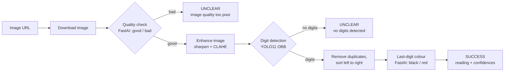

# Overview

FlowVision is a REST service that reads water meters from photos. A client sends the URL of a meter image, and FlowVision downloads it, checks that it is usable, detects the odometer digits, and returns the reading along with confidence scores. Clients can then send feedback on whether the reading was correct.

It runs three local models (no external AI APIs), and runs on CPU or GPU.

* [Getting Started](getting-started.md): install, configure and run the service
* [Architecture Overview](architecture-overview.md): components, the processing pipeline and storage
* [API Reference](api-reference.md): endpoints, request and response formats, status values
* [OpenAPI spec](flowvision_api_spec.yml): machine-readable API definition

### How a reading is extracted 

| Stage | Model file (`src/models/`) | Output |
| --- | --- | --- |
| Quality check | `bfm_fastai` | `good` or `bad`, with confidence |
| Digit detection | `individual_number_recognition_yolo11l.pt` | One oriented box per digit, classes `0`–`9` |
| Last-digit colour | `color_classification_fastai` | `black` or `red`, with confidence |

The last-digit colour tells the client whether the rightmost digit is a red (fractional) wheel, which it can use to place the decimal point. The service itself returns the digits only, with no decimal point.

### Endpoints 

| Method | Path | Purpose |
| --- | --- | --- |
| `GET` | `/` | Liveness check |
| `POST` | `/flowvision/v1/extract-reading` | Extract a reading from an image URL |
| `POST` | `/flowvision/v1/feedback` | Record whether a reading was correct |

Requests and responses are written to PostgreSQL in the background for auditing and model improvement. If the database is unreachable, the API still answers and the write failures are logged.

### Repository layout 

| Path | Contents |
| --- | --- |
| `read_meter.py` | Command-line tool: read meters from local photos without the server |
| `src/run.py` | Development entry point (uvicorn) |
| `src/routes.py` | FastAPI app and endpoints |
| `src/service/api/image_service.py` | Request orchestration: download, pipeline, response building |
| `src/service/api/metadata_service.py`, `database.py` | Background persistence to PostgreSQL |
| `src/service/vision/inference_utils.py` | Model loading, image enhancement, digit detection |
| `src/models/models.py` | Pydantic request and response models |
| `src/models/*` (binary) | The three trained models |
| `src/conf/` | `config.yaml`, config loader, logging setup, SQL queries |
| `Dockerfile` | Production image (gunicorn, auto-sized workers) |
| `flowvision.service` | Example systemd unit |
| `flowvision_db_ddl.sql` | Database and table creation script |
