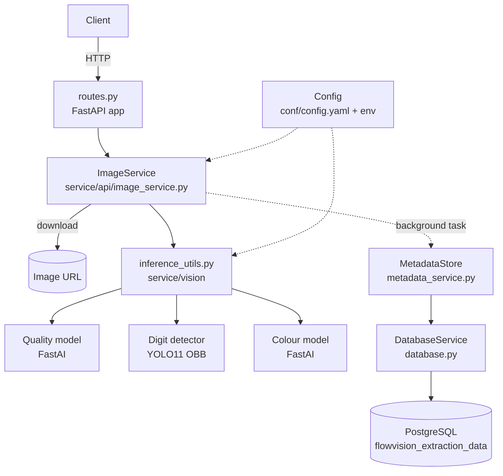
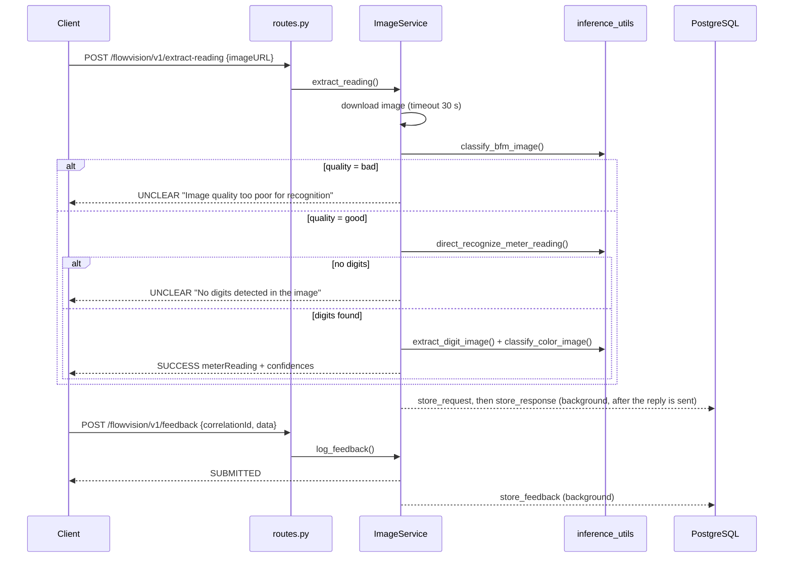

# Architecture Overview

This page describes how FlowVision is put together: its components, what happens during a request, how data is stored, and how it scales. For setup, see [Getting Started](getting-started.md). For the endpoint contract, see [API Reference](api-reference.md).

### Components 

| Component | File | Responsibility |
| --- | --- | --- |
| FastAPI app | `src/routes.py` | Defines the three endpoints. Builds `Config`, loggers and one `ImageService` at startup. |
| `ImageService` | `src/service/api/image_service.py` | Downloads the image, runs the pipeline, builds the response, schedules persistence, turns exceptions into error responses. |
| Inference utilities | `src/service/vision/inference_utils.py` | Loads the models, enhances the image, detects and orders digits, crops the last digit, classifies quality and colour. |
| `MetadataStore` | `src/service/api/metadata_service.py` | Converts requests, responses and feedback into rows. Logs and swallows database errors. |
| `DatabaseService` | `src/service/api/database.py` | SQLAlchemy engine (pooled, pre-ping). Each write runs in its own transaction. |
| SQL | `src/conf/queries.py` | The insert and update statements. |
| `Config` | `src/conf/config.py` | Loads `config.yaml` (or `CONFIG_PATH`). `find("a.b.c", default)` reads nested keys. |
| Loggers | `src/conf/logging.py` | Three daily-rotated log files (see [Getting Started](getting-started.md#logs)). |
| Data models | `src/models/models.py` | Pydantic request and response schemas. |

All three models are loaded once when the process starts and kept in memory.

### Request flow 

Background tasks run after the response has been sent, so database latency never slows down a reply.

### The extraction pipeline 

1. **Download.** The image at `imageURL` is fetched with a 30 s timeout (`image_download_timeout`). HTTP errors fail the request. The image is decoded once to RGB and reused by every later step.
2. **Quality check.** The FastAI quality model labels the whole image `good` or `bad`. Anything other than `good` stops here with status `UNCLEAR`. The quality result is returned in every case.
3. **Enhancement.** In HSV space, the brightness channel is sharpened (unsharp mask), then its contrast is boosted (CLAHE), and a global colour boost is applied. The parameters are under `image_enhancement` in `config.yaml`.
4. **Digit detection.** The YOLO11 oriented-bounding-box model finds individual digits (classes `0`–`9`). Detections with confidence ≤ 0.3 are discarded.
5. **De-duplication.** When two boxes overlap with IoU ≥ 0.3, only the more confident one is kept. IoU is computed exactly on the rotated polygons.
6. **Ordering.** Boxes are sorted by their leftmost x-coordinate and their classes joined into the reading, for example `024965`. Leading zeros are kept and no decimal point is added.
7. **Last-digit colour.** The rightmost digit is cropped along its polygon (masked to the box) and classified `black` or `red`.

The two thresholds are the constants `DIGIT_CONFIDENCE_THRESHOLD` and `DIGIT_IOU_THRESHOLD` in `inference_utils.py`.

`processingTime` in the response covers steps 1–7, including the download.

### Error handling 

* Any exception during extraction (a failed download, an unreadable image, a model error) is caught and returned as a response with `responseCode: "ERROR"`, `statusCode: 500` and an `error` object. The full stack trace goes to `api.log`.
* **These error responses are sent with HTTP status 200.** Clients must check `responseCode` or `statusCode` in the body, not the HTTP status.
* Invalid request bodies (missing `imageURL`, a malformed UUID) are rejected by FastAPI with a real HTTP 422 before reaching the service.
* Database failures in background tasks are logged and do not affect responses.

### Storage 

Everything goes into one table, `flowvision_extraction_data` (see `flowvision_db_ddl.sql`). Each extraction request fills in its row in three steps:

| Written by | Columns |
| --- | --- |
| `store_request` (insert) | `request_id`, `image_url`, `image_id` (always null), `metadata`, `request_timestamp` |
| `store_response` (update by `request_id`) | `meter_reading_status`, `meter_reading`, `correlation_id`, `response_timestamp`, `quality_status`, `quality_confidence`, `last_digit_color`, `color_confidence`, `processing_time` |
| `store_feedback` (update by `correlation_id`) | `extracted_reading_accurate`, `actual_reading`, `feedback_timestamp` |

Error responses are not stored, so a failed extraction leaves a row with only the request columns filled. The `extracted` field of a feedback request is logged but not stored.

### Concurrency and scaling 

The endpoints are `async`, but inference is synchronous CPU/GPU work, so each worker process handles one extraction at a time. This also keeps the shared models safe, since they are not thread-safe. To handle more requests at once, run more worker processes. The Docker image does this automatically (see [Getting Started](getting-started.md#run-with-docker)), and each worker holds its own copy of the models.

### Platform notes 

The FastAI model files were saved on Linux/macOS and contain `PosixPath` objects. On Windows, `inference_utils.py` maps these to `WindowsPath` while loading, so the service runs there without extra steps.
